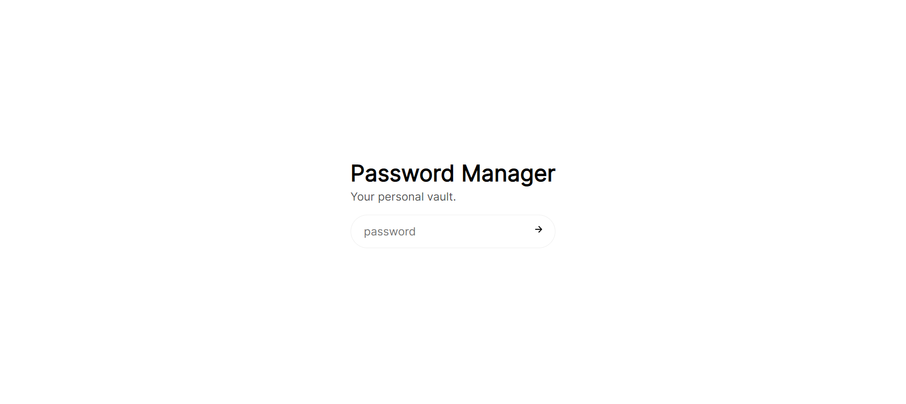
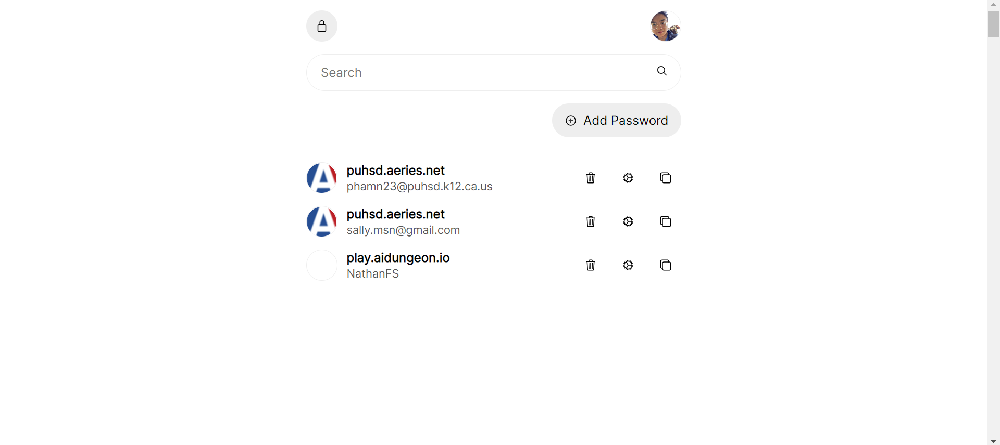
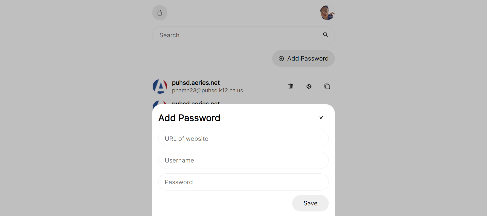

# Password Manager

Basic password manager

## Screenshots





## Usage

Activate PipEnv

```
py -m pipenv shell
```

Create a new account with a global password

```
py global_password.py
```

To merge existing passwords from a browser, export the passwords as a CSV file (usually found in settings) and copy the contents into `/passwords/passwords.csv`.

```
py password_merge.py
```

Start the Python Bottle server and go to `localhost:5500`

```
py main.py
```
